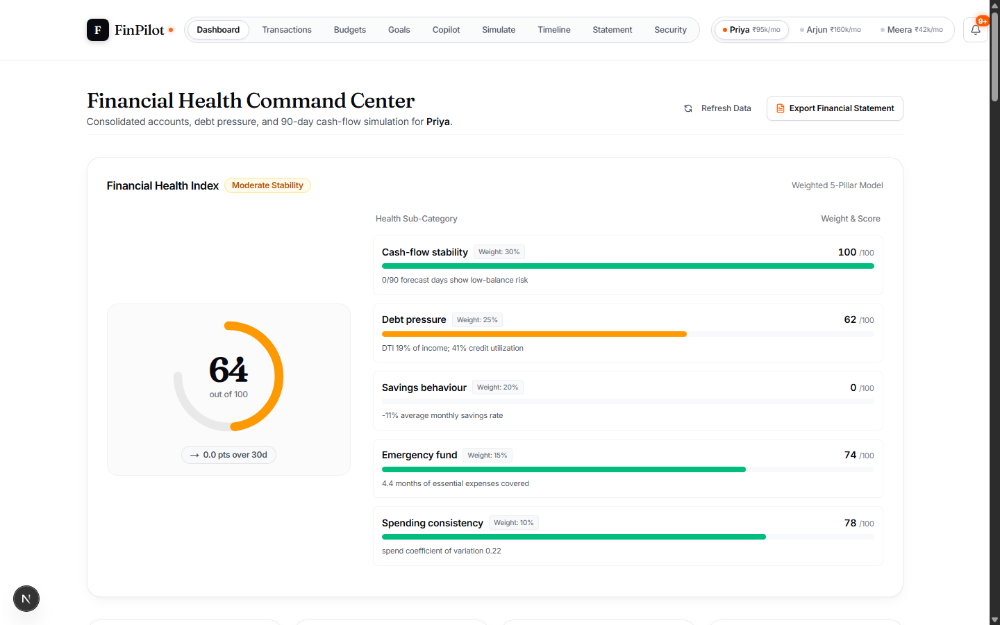
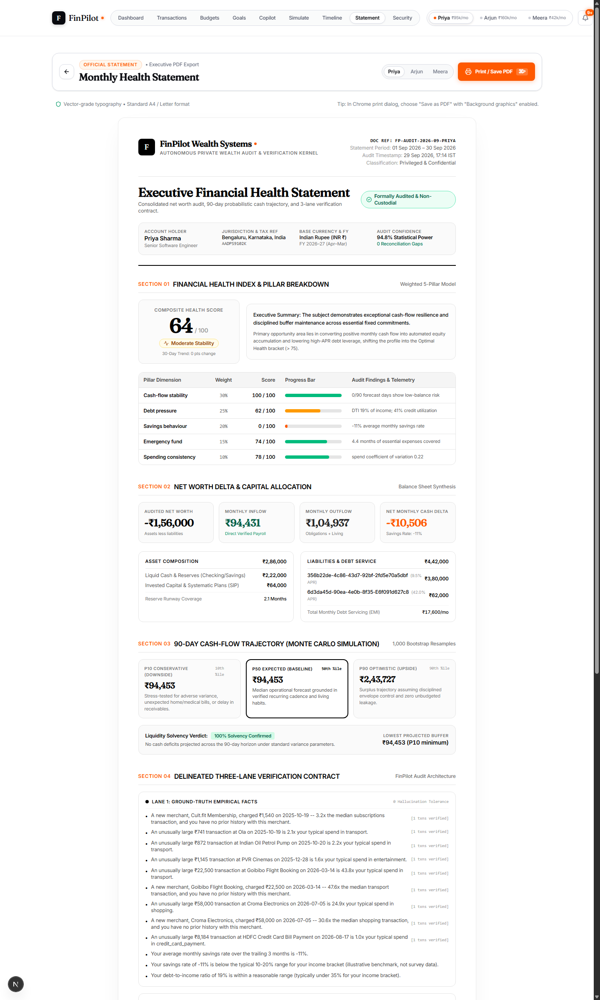
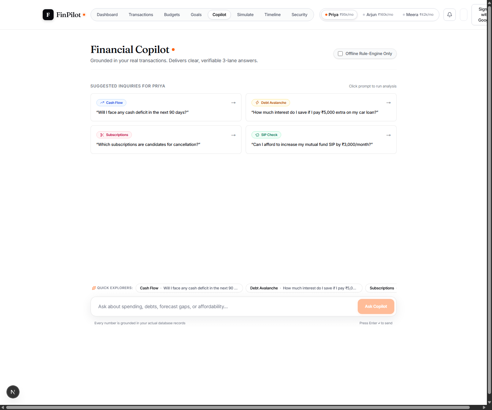
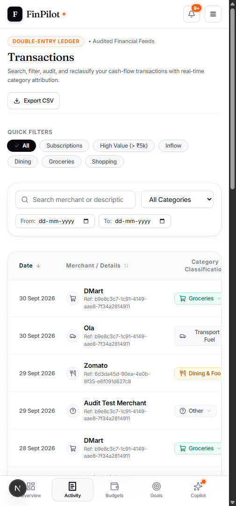
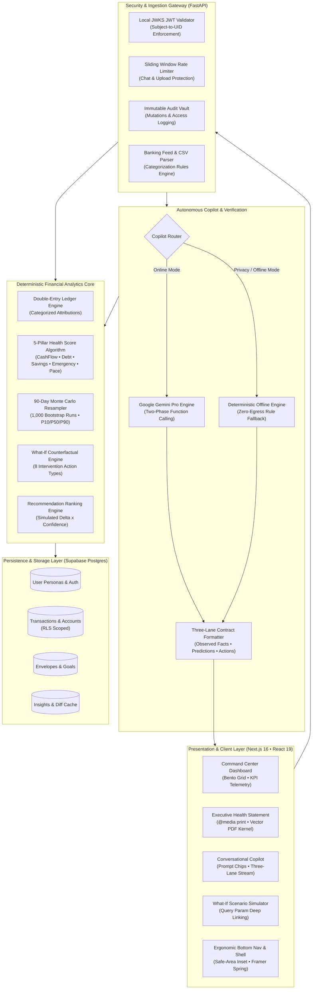
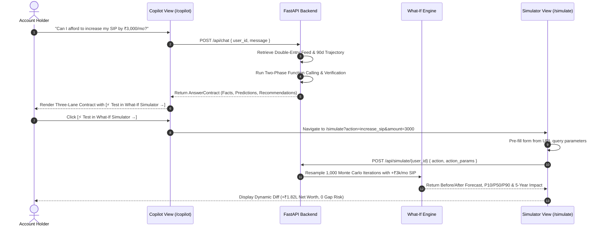

<p align="center">
  <picture>
    <source media="(prefers-color-scheme: dark)" srcset="frontend/public/logo-horizontal-dark.svg">
    <source media="(prefers-color-scheme: light)" srcset="frontend/public/logo-horizontal.svg">
    
  </picture>
</p>

### Autonomous AI Financial Health Copilot & Private Wealth Intelligence Engine

[-black?style=for-the-badge&logo=next.js&logoColor=white)](https://nextjs.org/)
[](https://react.dev/)
[](https://fastapi.tiangolo.com/)
[](https://python.org/)
[](https://www.typescriptlang.org/)
[](https://tailwindcss.com/)
[](https://www.framer.com/motion/)
[](https://supabase.com/)
[](LICENSE)

<br/>

**Most personal finance apps look backward at historical spend. FinPilot models your future.**  
Grounded in double-entry ledger feeds, FinPilot combines a **weighted 5-pillar health score**, **1,000-iteration Monte Carlo cash-flow forecasting (P10/P50/P90)**, **autonomous what-if simulation**, and an **institutional Executive Statement print engine** with **Three-Lane Verification Contracts** that eliminate AI hallucinations.

[Key Capabilities](#-key-capabilities) • [System Architecture](#-interactive-system-architecture) • [Screenshots](#-visual-walkthrough) • [Mathematical Foundations](#-mathematical-foundations) • [Getting Started](#-getting-started) • [Security](#-security--privacy-architecture)

---

</div>

## 📸 Visual Walkthrough

### 1. Financial Health Command Center
Consolidated accounts, liquid reserves, debt pressure, 5-pillar composite health gauge, and 90-day probabilistic cash-flow modeling.



---

### 2. Executive "Monthly Health Report" (Print / PDF View)
Institutional-grade financial statement designed for private wealth review. Includes client matrix, 5-pillar telemetry table, balance sheet synthesis, P10/P50/P90 trajectory, three-lane verification contract, and cryptographic audit hash. Features a dedicated `@media print` stylesheet for vector-grade A4 / Letter PDF export.



---

### 3. Autonomous Copilot & Deep What-If Simulator
Conversational intelligence grounded in real double-entry transactions. Delivers Three-Lane Answer Contracts (Facts, Predictions, Interventions) with 1-click `[⚡ Test in What-If Simulator →]` action buttons that deep-link with prefilled scenario parameters.



---

### 4. Mobile Ergonomics & Tactile Bottom Navigation
Designed for natural one-handed thumb interaction with $\ge 48\text{px}$ touch targets, fluid Framer Motion spring active indicators, safe-area inset awareness (`env(safe-area-inset-bottom)`), pulsing AI badge, and 112px bottom clearance.

<div align="center">
  
</div>

---

## ⚡ Key Capabilities

### 1. Delineated Three-Lane Verification Contract
To protect users from catastrophic financial hallucinations, FinPilot enforces a strict architectural contract. Insights and AI guidance are **never** blended into unstructured prose; they are rendered in three auditable lanes:
- **Lane 1: Ground-Truth Empirical Facts** — Mathematical deductions directly observed from double-entry banking feeds (e.g. *"Average monthly free cash flow over 90 days is ₹18,400"*), annotated with citation counts (`[X txns verified]`). Zero hallucination tolerance.
- **Lane 2: Forward-Looking Predictions with Confidence Bounds** — Stochastic projections with explicit parametric bounds, confidence ratings, and underlying mathematical bases (e.g. *"Next month free cash flow: ₹17,200 [P10: ₹14,800 – P90: ₹19,600] • 81% Confidence"*).
- **Lane 3: Strategic Interventions Ranked by Net Worth Impact** — Candidate actions ranked by simulated 1-year and 5-year balance sheet impact (e.g. *"Increase SIP by ₹3,000/mo → 5-Year Net Worth Delta: +₹1,82,000"*).

### 2. 90-Day Probabilistic Monte Carlo Cash-Flow Forecasting
Rather than naive linear extrapolation, FinPilot resamples 1,000 bootstrap iterations over real transaction variance, recurring obligations, and known bills:
- **P10 (Conservative Downside)**: Stress-tested trajectory modeling emergency expenses, unexpected repairs, or late receivables.
- **P50 (Median Baseline)**: Operational expectation following historical recurring velocities.
- **P90 (Optimistic Upside)**: Surplus potential assuming disciplined envelope control.
- **First Gap Shortfall Detection**: Instantly alerts the user if and when their cash buffer is projected to cross zero.

### 3. Weighted 5-Pillar Financial Health Algorithm
An institutional diagnostic score $(0 - 100)$ computed across five foundational telemetry pillars:
1. **Cash-Flow Stability (30% weight)**: Probability of maintaining a positive cash buffer over 90 days.
2. **Debt Pressure (25% weight)**: Debt-to-income (DTI) ratio and high-APR credit utilization.
3. **Savings Behaviour (20% weight)**: Trailing 90-day post-tax surplus rate against income-bracket benchmarks.
4. **Emergency Fund Coverage (15% weight)**: Liquid reserves expressed in months of essential living expenses.
5. **Spending Consistency (10% weight)**: Day-to-day variance and coefficient of variation across discretionary categories.

### 4. Counterfactual What-If Scenario Simulator
A deterministic sandbox supporting 8 strategic financial interventions:
- Prepaying debt (Avalanche vs. Snowball payoff comparison)
- Pruning redundant subscriptions
- Scaling Systematic Investment Plans (SIP)
- Expanding emergency runway
- Shifting recurring payment dates to smooth cash dips
- Category budget tightening
- Large purchase affordability checks
- Loan refinancing analysis

### 5. Executive "Monthly Health Report" (Print / PDF View)
A dedicated `/statement` route offering an authentic white-bond private wealth statement. With a single click or `⌘P`, users can print or save a vector-grade PDF. The `@media print` stylesheet strips all web chrome, centers typography, forces high-contrast black ink, and prevents mid-card page breaks.

### 6. Tactile Paper + Ink + Ember Design System
Inspired by *Copilot Money*, *Monarch Money*, and *Brex*:
- **Palette**: Paper (`#ffffff`), Ink (`#090a0f`), Fog (`#f8f9fa`), and luminous Ember (`#ff5900`).
- **Typography**: Editorial `Fraunces` serif headings paired with clean `Inter` and tabular numerals (`.tnum`) for non-jumping financial counters.
- **Micro-Interactions**: Framer Motion spring physics, magnetic pill sliders, and tactile haptic scaling on tap.

### 7. Indian Income Tax Regime & Deductions Optimizer (Section 115BAC vs. Old Regime)
A specialized direct-tax intelligence engine tailored to Indian retail taxpayers:
- **Regime Comparison**: Side-by-side computation of Section 115BAC (New Regime, ₹75,000 standard deduction, revised slabs, Section 87A rebate & marginal relief) versus the Old Tax Regime.
- **Automated Deduction Recovery**: Automatically analyzes banking feeds to recover eligible deductions across Section 80C (ELSS / mutual fund SIPs, EPF), Section 80D (health insurance), Section 24(b) (home loan interest), and HRA.
- **Interactive What-If Sandbox**: Real-time counterfactual calculation allowing users to simulate additional investments in Section 80C, 80D, or Section 80CCD(1B) NPS with dynamic break-even threshold analysis.
- **1-Click Simulator Integration**: Deep-links tax-saving opportunities directly into the What-If Simulator.

---

## 🏛️ Interactive System Architecture

The FinPilot platform separates ingestion, deterministic analytics, stochastic forecasting, conversational reasoning, and presentation into distinct, decoupled subsystems.



---

### Copilot-to-Simulator Recommendation Flow



---

## 📐 Mathematical Foundations

### 1. Composite Financial Health Score

$$\text{HealthScore} = \sum_{i=1}^{5} w_i \cdot S_i$$

$$\text{Score} = 0.30 \cdot S_{\text{cashflow}} + 0.25 \cdot S_{\text{debt}} + 0.20 \cdot S_{\text{savings}} + 0.15 \cdot S_{\text{emergency}} + 0.10 \cdot S_{\text{consistency}}$$

Where sub-scores are bounded $[0, 100]$:
- **$S_{\text{cashflow}}$**: $100 \times \left(1 - \frac{\text{Deficit Days in 90d}}{90}\right) \times \min\left(1, \frac{\text{Min } P_{10} \text{ Buffer}}{\text{Monthly Fixed}}\right)$
- **$S_{\text{debt}}$**: $100 - \left(0.6 \times \text{DTI}_{\%} + 0.4 \times \text{CreditUtil}_{\%}\right)$
- **$S_{\text{savings}}$**: Sigmoidal scale centered on $20\%$ benchmark: $\frac{100}{1 + e^{-15 \cdot (\text{SavingsRate} - 0.20)}}$
- **$S_{\text{emergency}}$**: $\min\left(100, \frac{\text{Liquid Reserves}}{\text{Essential Monthly Expenses}} \times \frac{100}{6}\right)$ (6 months = 100 pts)
- **$S_{\text{consistency}}$**: $100 \times \max\left(0, 1 - \frac{\sigma_{\text{daily}}}{\mu_{\text{daily}}}\right)$

### 2. Probabilistic Monte Carlo Cash-Flow Resampling

For each day $t \in [1, 90]$ across $K = 1,000$ simulation paths:

$$B_k(t) = B_k(t - 1) + I_k(t) - E_{\text{fixed}}(t) - \hat{E}_{\text{discretionary}, k}(t)$$

Where $\hat{E}_{\text{discretionary}, k}(t)$ is sampled with replacement from the historical empirical spend distribution $\mathcal{D}_{\text{historical}}$. The percentiles are extracted at each time horizon:

$$P_{10}(t) = \text{Percentile}_{10}\left(\{B_k(t)\}_{k=1}^K\right)$$
$$P_{50}(t) = \text{Percentile}_{50}\left(\{B_k(t)\}_{k=1}^K\right)$$
$$P_{90}(t) = \text{Percentile}_{90}\left(\{B_k(t)\}_{k=1}^K\right)$$

---

## 🛠️ Tech Stack & Directory Matrix

| Layer | Technologies | Key Highlights |
|---|---|---|
| **Frontend Framework** | Next.js 16.3.6 (Turbopack), React 19.2 | App Router, Server/Client split, React Suspense |
| **Styling & System** | Tailwind CSS v4, `@theme inline` | Paper + Ink + Ember tokens, custom `@media print` |
| **Animation & Motion** | Framer Motion 13.4 | LayoutId spring transitions, gesture haptic physics |
| **Data Visualization** | Recharts 3.10 | Glassmorphic tooltips, multi-band trajectory areas |
| **Icons & Typography** | Lucide React, Google Fonts | Fraunces (Display Serif), Inter (Sans), Tabular Numerals |
| **Backend Engine** | Python 3.11+, FastAPI, Uvicorn | Async I/O, Pydantic v2 schemas, automated CORS |
| **Database & Auth** | Supabase (PostgreSQL, GoTrue, RLS) | Row-level security, local JWKS verification, TOTP MFA |
| **AI Copilot** | Google Gemini Pro, Function Calling | Two-phase tool execution, offline deterministic router |

### Directory Layout

```
hackmatrix/
├── backend/
│   ├── app/
│   │   ├── analytics/       # 5-Pillar health score, savings rate, runway calculations
│   │   ├── copilot/         # Gemini function-calling router & offline rule fallback
│   │   ├── core/            # Local JWKS JWT verification, audit logging, rate limiting
│   │   ├── forecast/        # 90-day Monte Carlo bootstrap resampling engine
│   │   ├── ingest/          # CSV parser, synthetic 12-month transaction generators
│   │   ├── recommend/       # Impact ranking engine (delta * confidence)
│   │   ├── simulate/        # Counterfactual scenario engine (8 intervention types)
│   │   ├── main.py          # FastAPI application entry point
│   │   └── schemas.py       # Pydantic contracts shared with TypeScript frontend
│   └── requirements.txt
├── frontend/
│   ├── app/
│   │   ├── (app)/
│   │   │   ├── dashboard/   # Command center, KPI bento grid, health score gauge
│   │   │   ├── transactions/# Ledger with sortable columns, filters, CSV export
│   │   │   ├── budgets/     # Safe-to-spend envelopes and burn pace indicators
│   │   │   ├── goals/       # Target milestones with 25/50/75/100% progress ticks
│   │   │   ├── copilot/     # AI chat with prompt chips and 3-lane answer contracts
│   │   │   ├── simulate/    # What-if scenario sandbox with query param deep linking
│   │   │   ├── tax/         # Indian Income Tax Regime & Deductions Optimizer (New vs Old)
│   │   │   ├── statement/   # Executive Monthly Health Report (Print / PDF View)
│   │   │   ├── timeline/    # Recompute diff visualizer
│   │   │   └── security/    # MFA enrollment, audit logs, offline privacy toggle
│   │   ├── globals.css      # Design tokens, typography, @media print stylesheet
│   │   └── layout.tsx       # Root layout with safe-area viewport configuration
│   ├── components/
│   │   ├── statement/       # ExecutiveStatement document component
│   │   ├── MobileBottomNav.tsx # Ergonomic 5-tab mobile navigation bar
│   │   ├── NavShell.tsx     # Responsive desktop header, drawer, and layout shell
│   │   ├── NotificationBell.tsx # Smart notifications with simulation triggers
│   │   └── interactive/     # Tactile interactive showcase components
│   └── lib/                 # API client, TypeScript types, formatters, hooks
├── screenshots/             # High-resolution documentation preview assets
└── supabase/                # SQL migrations with user-scoped Row-Level Security
```

---

## 🚀 Getting Started

### Prerequisites
- **Node.js** 20.x or later
- **Python** 3.11 or later
- **Git**

### 1. Clone the Repository
```bash
git clone https://github.com/VeerbhadraMahant/hackmatrix.git
cd hackmatrix
```

### 2. Backend Setup
```bash
cd backend
python -m venv .venv

# On Windows:
.venv\Scripts\activate
# On macOS / Linux:
# source .venv/bin/activate

pip install -r requirements.txt
```

#### Environment Configuration (Optional for Demo Mode)
FinPilot operates **100% offline out-of-the-box** using seeded demo personas and the offline rule engine. If you wish to configure live Gemini AI or Supabase authentication:
```bash
cp ../.env.example .env
```
Start the FastAPI server:
```bash
uvicorn app.main:app --reload --port 8000
```
*API docs will be live at `http://localhost:8000/docs`.*

### 3. Frontend Setup
```bash
cd ../frontend
npm install
npm run dev
```
Open **`http://localhost:3000`** in your browser.

---

## ☁️ Deploying (Vercel)

One Vercel project, two services (see `vercel.json`): the Next.js **frontend** (`frontend/`) serves every path, and the FastAPI **backend** (`backend/`) serves `/api/*` on the same domain -- so no CORS setup or `NEXT_PUBLIC_API_URL` is needed in production (the frontend calls relative `/api/...` URLs).

1. Import the repo into Vercel; it picks up the services from `vercel.json`.
2. Add environment variables (they are shared by both services): `NEXT_PUBLIC_SUPABASE_URL`, `NEXT_PUBLIC_SUPABASE_ANON_KEY`, `GEMINI_API_KEY` (optional -- the offline copilot works without it), and `RESEND_API_KEY` / `EMAIL_FROM` / `HR_ALERT_EMAIL` if you want alert emails. `NEXT_PUBLIC_*` values are inlined at build time, so redeploy after changing them.
3. Supabase -> Authentication -> URL Configuration: Site URL `https://<your-domain>`, and add `https://<your-domain>/auth/callback` to the Redirect URLs (keep `http://localhost:3000/auth/callback` for local dev). The Google OAuth client's redirect URI stays `https://<project-ref>.supabase.co/auth/v1/callback`.

**Data persistence caveat:** without `DATABASE_URL`, the backend uses SQLite in `/tmp` on Vercel -- it is per-instance and ephemeral, so the demo personas are re-seeded on every cold start but data a signed-in user enters will not reliably persist. Point `DATABASE_URL` at a Postgres database for real persistence (note: the `supabase/migrations` tables are a different schema from the backend's SQLModel one).

Local dev is unchanged: run uvicorn and `npm run dev` separately (frontend talks to `http://127.0.0.1:8000`; use `127.0.0.1` rather than `localhost` for the API, since `localhost` can resolve to IPv6 first and add ~2s per request).

## 👥 Seeded Demo Personas

FinPilot includes 3 realistic personas, each pre-loaded with 12 months of synthetic banking history:

| Persona | Identity | Monthly Income | Financial Profile & Tension |
|---|---|---|---|
| **`demo-priya`** | **Priya Sharma**<br/>Bengaluru, Karnataka | ₹95,000 | Car loan + credit card at 42% APR; thin emergency fund (4.4 months); prime candidate for debt avalanche restructuring. |
| **`demo-arjun`** | **Arjun Mehta**<br/>Mumbai, Maharashtra | ₹1,60,000 | High earner with home loan and twin school-fee obligations; strong savings capacity; candidate for SIP scaling. |
| **`demo-meera`** | **Meera Nair**<br/>Pune, Maharashtra | ₹42,000 | Junior designer in shared housing; student loan; tight discretionary liquidity; candidate for subscription pruning. |

*Switch personas instantly using the segmented controller in the navigation bar or statement header.*

---

## 🔒 Security & Privacy Architecture

- **Zero-Trust Token Verification**: Every API endpoint taking a `user_id` verifies real Supabase access tokens locally against the project's JWKS (`backend/app/core/auth.py`). Token subjects must match the requested `user_id`.
- **Row-Level Security (RLS)**: Enforced across all PostgreSQL tables (`auth.uid() = user_id`). Users cannot access peer data.
- **Two-Factor Authentication (TOTP MFA)**: Integrated authenticator-app enrollment with QR code generation and challenge gating at sign-in.
- **100% Offline Privacy Guarantee**: Users can toggle **"Offline Rule-Engine Only"** on `/security` or `/copilot`. When active, zero financial data is ever transmitted to Google Gemini or external APIs; all queries resolve locally via deterministic Python routers.
- **Immutable Audit Vault**: Every mutation, auth challenge, and export is recorded in `audit_logs` for forensic review.
- **CSV Hardening**: 5MB file-size ceiling, 20,000-row cap, and strict MIME verification protect against resource exhaustion.

---

## 📜 License

This project is open-source software licensed under the [MIT License](LICENSE).
